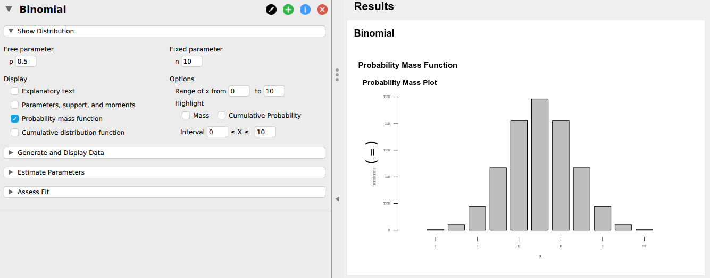

# Statistical modelling

## The distributions module

To add the "Distributions" module to the menu, you should first click on the "+" icon on the top right. You will then see a menu with add-on modules. If you tick the "Distributions" item, this will then add a new icon to the main menu, called "Distributions".

To be able to run the module, JASP needs to have an open dataset. The number of rows in that dataset will be a limit on the number of observations you can simulate. If you are thinking of running a large simulation, then you need to have a large dataset open. To make this somewhat easier, I've created a "dummy" dataset, with one empty variable with 10,000 "observations". You can download it [here](https://mspeekenbrink.github.io/sdam-jasp-companion/data/dummy.csv). Download the file to a local folder, and then open it as usual with &#9776;` > Open > Computer > Browse`.

When you click on the Distributions icon, you will see a list of included distributions:
```{r distributions-main-menu, out.width="20%"}

```
For now, we will use the "Binomial" option. If you click on that, you will see something like:
```{r distributions-binomial-1, out.width="100%"}

```

There are four sub-menu's that make up a Distributions block:

* `Show Distribution`: This includes various ways to visualize a distribution, such as a _Probability mass function_ -- which is the probability distribution as plotted in the SDAM book -- and a _cumulative distribution function_ -- which displays the probability of a value and anything smaller than it. Importantly, this sub-menu also allows you to change the two parameters of the Binomial distribution: $n$, the total number of observations (e.g. the total number of guesses), and "p" (which is what we referred to as $\theta$), the probability of a "success" (e.g. a correct prediction). 
* `Generate and Display Data`: this allows you to generate random samples from a Binomial distribution with parameters as specified in the `Show Distribution` menu. You can choose a new name for the variable containing the simulations, as well as the _number of samples_ you want to draw (this defaults to the number of observations in the open data set, so if you have the "dummy.csv" open, you probably want to change that).
* `Estimate Parameters` This will use a variable with simulated data and provide you with the (maximum likelihood) estimates of the parameters, and optionally the "Standard error" (this is the standard deviation of the sampling distribution of the estimates) and a confidence interval (we will get to this later on). Note that if you say simulate 100 draws from a Binomial distribution each with $n=8$ observations, you get a single estimate over all these 100 simulations, not an estimate for each (which is what we have been doing in SDAM up to now). 
* `Assess Fit`: This provides some means to compare the simulated sample you generated to the true distribution from which it was sampled. These are mainly graphical tools, such as a histogram with theoretical probabilities overlayed, and Q-Q and P-P plots (more about these later). In addition, you there is a _Chi-square_ test which tests the null hypothesis that the data was drawn from a Binomial distribution with the parameters as specified in the `Show Distribution` menu. More about such tests later as well.

## Simulating data

```{r distributions-binomial-generate-sample, out.width="80%"}

```

To simulate data with the Distributions module, you should first choose a name for the new variable which will contain your simulations. Also make sue you have selected the correct parameters ($n$ and $p$) in the `Show Distribution` menu. Then choose the number of simulated data points to draw under `Number of samples` (e.g. 100). You can then click on the `Draw samples` button to generate the simulated data. When I was trying this, I then had to click inside the Variables box to actually see the new variable show up. You may have to do this as well. You can then select the new variable and place it in the `Get variable from data set` box. If you ticked `Descriptives` and for instance a `Bar plot`, you should then see populated with the data from the simulation. Voila!

if you actually want to see the simulated variable, you can get back to the data set by clicking on the little right pointing arrow completely on the left-hand side of the screen. This will open the data view, which you can close again by clicking on the left pointing arrow on the complete right-hand side of the screen.   